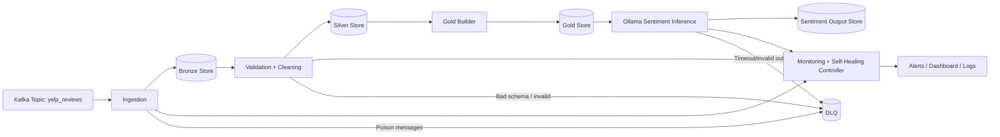
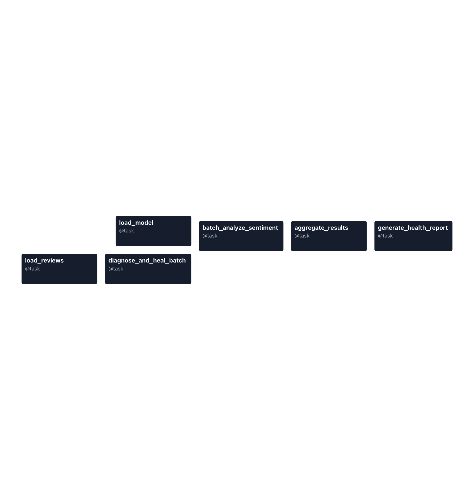

# Self-Healing Real-Time Yelp Review Sentiment Pipeline (Airflow + Kafka + Ollama)

A production-style, self-healing data/ML pipeline that ingests **real-time Yelp reviews**, curates them through a **Medallion (Bronze/Silver/Gold)** architecture, and performs **sentiment classification (positive/negative)** using an **Ollama-hosted LLM**. The system includes a **monitoring + remediation layer** to detect failures, isolate bad data, and restore healthy operation with minimal manual intervention.

---

## What this repository delivers

### Core capabilities
- **Real-time ingestion**: Kafka consumer processing Yelp review events.
- **Medallion architecture**:
  - **Bronze**: raw immutable events
  - **Silver**: cleaned + validated + deduplicated
  - **Gold**: analytics-ready, sentiment-enriched outputs
- **LLM inference**: sentiment classification via **Ollama** (Python SDK).
- **Self-healing pipeline**:
  - automated retries + backoff
  - circuit breaker around inference
  - DLQ for poison messages
  - replay/reprocess when downstream recovers (idempotent)
  - health checks to pinpoint where failures occur (ingestion, transform, inference, write)
- **Monitoring**: pipeline health, model call health, data quality, and remediation tracking.

---

## Architecture

Tech stack

Orchestration: Apache Airflow

Streaming: Kafka

Storage: DynamoDB (source integration) + Postgres (metadata/ops) + your Bronze/Silver/Gold stores

ML/Inference: Ollama (ollama>=0.6.0), PyTorch (torch)

Language: Python

Testing: pytest

Python dependencies (minimum)
apache-airflow>=3.0.6
apache-airflow-providers-fab>=3.0.0
torch
ollama>=0.6.0
psycopg2-binary>=2.9.0
pytest

Metrics and SLOs (recommended for GitHub)

This project tracks metrics across real-time performance, data quality, LLM inference health, and self-healing effectiveness.

1) Real-time performance
Metric	Why it matters	Target/SLO
End-to-end latency (p95): event_time → gold_ready_time	Proves “real-time”	≤ 2–5 min
Kafka consumer lag (p95)	Detects backlog/stalls	≤ 1,000 msgs
Throughput: msgs/sec	Capacity indicator	Baseline + max
DLQ rate	Data hygiene + resilience	< 0.5%
2) Data quality (Medallion)
Metric	Why it matters	Target/SLO
Schema validation pass rate (Silver)	Prevents breaking downstream	≥ 99%
Dedup effectiveness: unique_review_id/total	Prevents double-counting	≥ 99.5%
Gold reconciliation ratio: gold_rows / silver_rows	Ensures completeness	≥ 99%
Null rate (required fields)	Detects regressions	< 0.1%
3) Ollama inference health
Metric	Why it matters	Target/SLO
Inference latency (p95)	Responsiveness	≤ 1–2s
Timeout/error rate	Serving stability	< 1%
Valid-output rate (parseable/structured)	Prevents pipeline breaks	≥ 99%
Sentiment drift: %positive over time	Detects prompt/data changes	Alert on spike
4) Self-healing effectiveness (key differentiator)
Metric	Definition	Target/SLO
Auto-remediation trigger count	How often self-heal engaged	Track trend
Auto-remediation success rate	successful heals / total heals	≥ 90%
MTTR (Mean Time To Recover)	failure → healthy state	≤ 5–10 min
Manual intervention rate	incidents needing human / total	↓ over time
Healing safety rate	heals that do not introduce duplicates/data loss	≥ 99%
Root-cause attribution rate	failures tagged to known category (Kafka/schema/model/DB/etc.)	≥ 95%
5) Model quality (offline, reproducible)

If you have labeled data, publish:

Accuracy / Precision / Recall / F1

Confusion matrix

Sentiment Consistency Rate: label agreement over N repeated runs (useful for non-deterministic LLM outputs)

